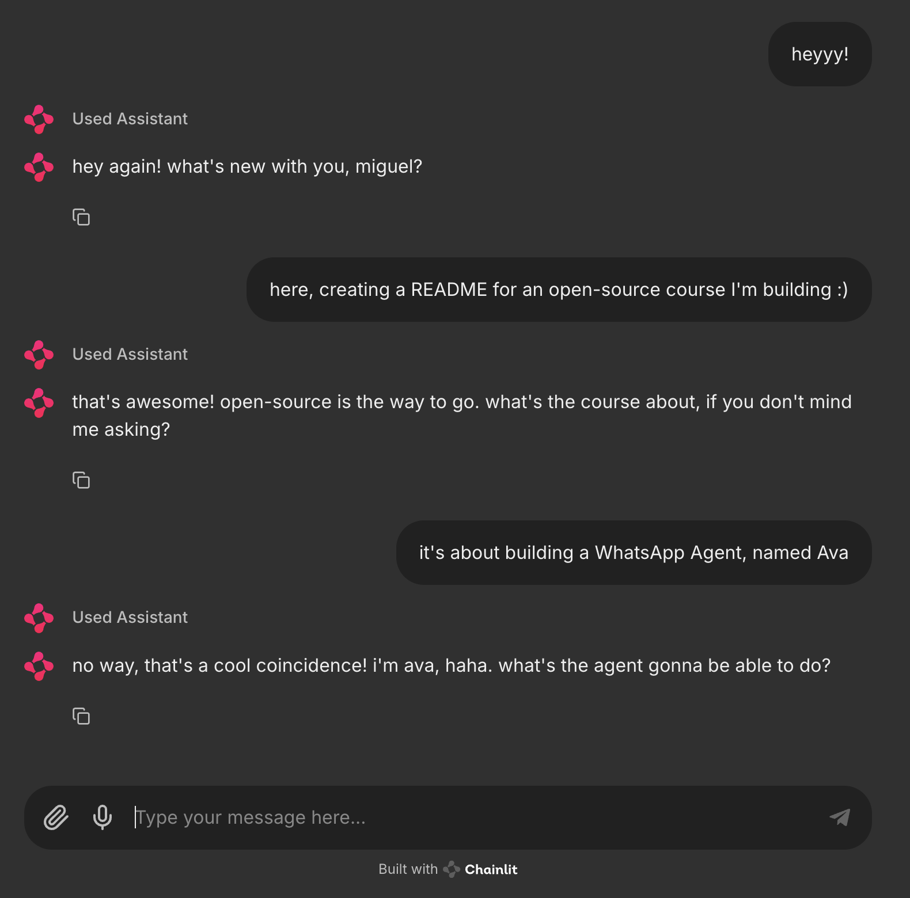

# 1. Clone the repository

First thing first, clone the repository.

```
git clone https://github.com/neural-maze/ava-whatsapp-agent-course.git
cd ava-whatsapp-agent-course
```

# 2. Install uv

Instead of `pip` or `poetry`, we are using `uv` as the Python package manager. 

To install uv, simply follow this [instructions](https://docs.astral.sh/uv/getting-started/installation/). 

# 3. Install the project dependencies

Once uv is intalled, you can install the project dependencies. First of all, let's create a virtual environment.

```bash
uv venv .venv
. .venv/bin/activate # or source .venv/bin/activate
uv pip install -e .
```
Just to make sure that everything is working, simply run the following command:

```bash
 uv run python --version
```

The Python version should be `Python 3.12.8`.


# 4. Environment Variables

Now that all the dependencies are installed, it's time to populate the `.env` file with the correct values.
To help you with this, we have created a `.env.example` file that you can use as a template.

```
cp .env.example .env
```

Now, you can open the `.env` file with your favorite text editor and set the correct values for the variables.
You'll notice there are a lot of variables that need to be set.

```
GROQ_API_KEY=""

ELEVENLABS_API_KEY=""
ELEVENLABS_VOICE_ID=""

TOGETHER_API_KEY=""

QDRANT_URL=""
QDRANT_API_KEY=""

WHATSAPP_PHONE_NUMBER_ID = ""
WHATSAPP_TOKEN = ""
WHATSAPP_VERIFY_TOKEN = ""
```

In this doc, we will show you how to get the values for all of these variables, except for the WhatsApp ones. 
That's something we will cover in a dedicated lesson, so don't worry about it for now, **you can leave the WhatsApp variables empty**.

### Groq

To create the GROQ_API_KEY, and be able to interact with Groq models, you just need to follow this [instructions](https://console.groq.com/docs/quickstart).


Once you have created the API key, you can copy it and paste it into an `.env` file (following the same format as the `.env.example` file).

### ElevenLabs

To create the ELEVENLABS_API_KEY you need to create an account in [ElevenLabs](https://elevenlabs.io/). After that, go to your account settings and create the API key.


As for the voice ID, you can check the available voices and select the one you prefer! We'll cover this in a dedicated lesson.

### Together AI

Log in to [Together AI](https://www.together.ai/) and, inside your account settings, create the API key.


As we did with the previous API keys, copy the value and paste it into your own `.env` file.

### Qdrant

This project uses Qdrant both locally (you don't need to do anything) and in the cloud (you need to create an account in [Qdrant Cloud](https://login.cloud.qdrant.io/)).

Once you are inside the Qdrant Cloud dashboard, create your API key here:


You also need a QDRANT_URL, which is the URL of your Qdrant Cloud instance. You can find it here:


Copy both values and paste them into your own `.env` file.

**This is everything you need to get the project up and running.**

# 5. First run

Once you have everything set up, it's time to run the project locally. This is the best way to check that everything is working before starting the course.

To run the project locally, we have created a [Makefile](../Makefile). Use the command `ava-run` to start the project.

```bash
make ava-run
```

This command will start a Docker Compose application with three services:

* A Qdrant Database (http://localhost:6333/dashboard)
* A Chainlit interface (http://localhost:8000)
* A FastAPI application (http://localhost:8080/docs)

The FastAPI application is necessary for the WhatsApp integration, but that's something we will cover in Lesson 6. So, for now,
you can ignore it. Simply click the link to the Chainlit interface to start interacting with Ava.

You should see something like this:



Now that we have verified that everything is working, it's time to move on to the [Course Syllabus](../README.md) and start the first lesson!

> If you want to clean up the docker compose application and all the related local folders, you can run `make ava-delete`. For more info, check the [Makefile](../Makefile).